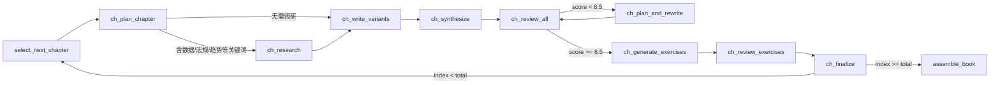

# 架构文档

## 总览

kougi-forge 是一个基于 LangGraph.js 的有状态多智能体系统。用户输入一个主题，系统通过五个阶段的流水线自动生成完整教材，在关键节点支持人工介入确认。

整个流程是一个**有向状态图**，所有节点共享同一份全局状态（`TextbookState`），通过 `FileCheckpointSaver` 持久化到磁盘，支持随时中断和恢复。

---

## 整体流程

```mermaid
flowchart TD
    START(["开始"]) --> p1_in

    subgraph P1[" 阶段一：需求分析 "]
        p1_in(["进入"]):::entry
        p1_in --> parse_input[解析输入]
        parse_input --> check_sufficiency[检查需求完整性]
        check_sufficiency -->|不足| ask_clarification[追问用户]
        ask_clarification --> check_sufficiency
        check_sufficiency -->|充分 / 达到追问上限| fill_defaults[填充默认值]
        fill_defaults --> generate_project_def[生成项目定义]
        generate_project_def --> p1_out(["输出：TextbookProject"]):::exit
    end

    p1_out --> p2_in

    subgraph P2[" 阶段二：蓝图规划 "]
        p2_in(["进入"]):::entry
        p2_in --> generate_blueprints[生成多方案蓝图]
        generate_blueprints --> compare_and_merge[比较合并]
        compare_and_merge --> critique_blueprint[评审蓝图]
        critique_blueprint -->|质量不达标| revise_blueprint[修订蓝图]
        revise_blueprint --> critique_blueprint
        critique_blueprint -->|通过 / 达到修订上限| confirm_blueprint{"用户确认"}
        confirm_blueprint -->|拒绝| revise_blueprint
        confirm_blueprint -->|确认| p2_out(["输出：Blueprint"]):::exit
    end

    p2_out --> p3_in

    subgraph P3[" 阶段三：样章生成 "]
        p3_in(["进入"]):::entry
        p3_in --> sample_plan_chapter[规划样章]
        sample_plan_chapter --> sample_write_variants[并发撰写多版本]
        sample_write_variants --> sample_synthesize[综合最优版本]
        sample_synthesize --> confirm_sample{"用户确认风格"}
        confirm_sample -->|调整意见| sample_write_variants
        confirm_sample -->|确认| p3_out(["输出：样章 + 风格指南"]):::exit
    end

    p3_out --> p4_in

    subgraph P4[" 阶段四：章节生产 ×N "]
        p4_in(["进入"]):::entry
        p4_in --> select_next_chapter[选择下一章]
        select_next_chapter --> ch_plan_chapter[规划章节]
        ch_plan_chapter -->|需要资料| ch_research[资料调研]
        ch_plan_chapter -->|无需调研| ch_write_variants
        ch_research --> ch_write_variants[并发撰写多版本]
        ch_write_variants --> ch_synthesize[综合草稿]
        ch_synthesize --> ch_review_all[多专家并行审校]
        ch_review_all -->|质量不达标| ch_plan_and_rewrite[规划修订]
        ch_plan_and_rewrite --> ch_review_all
        ch_review_all -->|通过| ch_generate_exercises[生成练习题]
        ch_generate_exercises --> ch_review_exercises[审查练习题]
        ch_review_exercises --> ch_finalize[章节定稿]
        ch_finalize -->|还有章节| select_next_chapter
        ch_finalize -->|全部完成| p4_out(["输出：全部章节 + 术语表"]):::exit
    end

    p4_out --> p5_in

    subgraph P5[" 阶段五：全书组装 "]
        p5_in(["进入"]):::entry
        p5_in --> assemble_book[组装全书]
        assemble_book --> consistency_check[一致性检查]
        consistency_check --> global_revision[全书修订]
        global_revision --> format_output[输出文件]
        format_output --> final_confirmation{"最终确认"}
        final_confirmation --> p5_out(["输出：Markdown 教材"]):::exit
    end

    p5_out --> END(["结束"])

    classDef entry fill:#d4edda,stroke:#28a745,color:#155724
    classDef exit  fill:#cce5ff,stroke:#004085,color:#004085
```



---

## 各阶段说明

### 阶段一：需求分析

| 节点 | 职责 |
|------|------|
| `parse_input` | 从用户原始输入中提取主题、受众、深度、风格等结构化字段 |
| `check_sufficiency` | 判断需求是否充分，输出 `isSufficient` 标志 |
| `ask_clarification` | 向用户追问缺失信息（最多 `maxClarificationRounds` 轮） |
| `fill_defaults` | 对仍为空的字段填入合理默认值 |
| `generate_project_def` | 综合所有需求，生成 `TextbookProject`（教材元数据和风格指南） |

### 阶段二：蓝图规划

| 节点 | 职责 |
|------|------|
| `generate_blueprints` | 并发生成多个章节目录方案（`BlueprintVariant[]`） |
| `compare_and_merge` | 对比各方案优劣，融合成一份最优蓝图 |
| `critique_blueprint` | 对蓝图打分（满分 10 分），输出详细评审意见 |
| `revise_blueprint` | 按评审意见修订蓝图（最多 `blueprintMaxRounds` 轮） |
| `confirm_blueprint` | **人工确认节点**（`interrupt`）：用户审阅并决定是否接受或要求修改 |

质量门：`critique.score >= blueprintPassScore`（默认 8.5）才能跳过修订直接进入确认。

### 阶段三：样章生成

用第一章作为样章，让用户在全量生产前确认写作风格。

| 节点 | 职责 |
|------|------|
| `sample_plan_chapter` | 规划样章的小节结构、关键知识点、示例类型 |
| `sample_write_variants` | 并发生成三种风格变体（`popular` / `rigorous` / `case-based`） |
| `sample_synthesize` | 综合三版本取长补短，生成最终草稿 |
| `confirm_sample` | **人工确认节点**：展示前 3000 字预览，用户可确认、提意见或要求重写 |

若用户提出风格调整意见（非"重写"），意见追加到 `styleGuide`，后续所有章节写作都会受此约束。

### 阶段四：章节生产

对蓝图中每一章循环执行，已完成的样章（第一章）跳过。



| 节点 | 职责 |
|------|------|
| `ch_plan_chapter` | 将章节规划细化为小节、知识点、示例、图表建议 |
| `ch_research` | 对含"数据/法规/趋势/文献"等关键词的章节调研背景资料 |
| `ch_write_variants` | 并发生成 popular / rigorous / case-based 三个版本 |
| `ch_synthesize` | 综合三版本（或在样章阶段直接返回单版本） |
| `ch_review_all` | 多专家角色（学科专家、教学设计师、语言编辑）并行审校，汇总评分 |
| `ch_plan_and_rewrite` | 根据审校意见制定修订计划并重写（最多 `chapterMaxRevisionRounds` 轮） |
| `ch_generate_exercises` | 生成各类型练习题（选择、填空、编程、思考题） |
| `ch_review_exercises` | 审查练习题质量（难度分布、答案准确性） |
| `ch_finalize` | 章节定稿，提取术语入 `glossary`，生成章节摘要供后续章节上下文引用 |

### 阶段五：全书组装

| 节点 | 职责 |
|------|------|
| `assemble_book` | 将所有章节、练习题、术语表拼装为完整书稿 |
| `consistency_check` | 检查术语一致性、难度曲线、风格统一性，输出问题清单 |
| `global_revision` | 按问题清单对全书做统一修订 |
| `format_output` | 生成 Markdown 文件，写入 `OUTPUT_DIR` |
| `final_confirmation` | **人工确认节点**：展示最终产物摘要，用户确认后流程结束 |

---

## 状态结构

所有节点读写同一份 `TextbookState`，关键字段如下：

```
TextbookState
├── userInput          原始用户输入
├── clarification      需求澄清状态（轮次、是否充分）
├── textbookProject    教材元数据（标题、受众、风格指南等）
├── blueprintVariants  多方案蓝图列表
├── blueprint          最终确认的蓝图（含章节目录）
├── chapterPlans       各章节规划 { chapterId → ChapterPlan }
├── research           各章节调研资料 { chapterId → ResearchNotes }
├── draftVariants      各章节多版本草稿 { chapterId → DraftVariant[] }
├── drafts             各章节综合草稿 { chapterId → ChapterDraft }
├── reviews            各章节审校结果 { chapterId → ChapterReviews }
├── exercises          各章节练习题 { chapterId → ChapterExercises }
├── chapterSummaries   各章节摘要（用于后续章节的上下文）
├── glossary           全书术语表（各章节累加）
├── recurringIssues    审校中反复出现的问题（跨章节传递）
├── finalBook          最终书稿
└── workflow           流程控制状态（当前阶段、当前章节、修订轮次）
```

Record 类型字段使用合并 reducer（`{ ...prev, ...update }`），支持并发写入不同 key。

---

## 持久化与断点续写

`FileCheckpointSaver` 将每个 LangGraph checkpoint 以 JSON 文件形式保存在 `.checkpoints/<threadId>/` 目录下：

```
.checkpoints/
└── session-1234567890/
    ├── index.json          checkpoint ID 列表
    ├── <checkpoint-id>.json
    └── tokens.json         本次会话累计 token 用量
```

任意时刻 `Ctrl+C` 中断后，使用 `--resume <threadId>` 从最近的 checkpoint 继续，不会重复执行已完成的节点。

---

## 人工确认节点

流程中共有三处 `interrupt`（LangGraph 的人工介入机制）：

| 节点 | 时机 | 用户可操作 |
|------|------|-----------|
| `confirm_blueprint` | 蓝图规划完成后 | 确认 / 提出修改意见 |
| `confirm_sample` | 样章生成后 | 确认风格 / 提出调整 / 要求重写 |
| `final_confirmation` | 全书输出后 | 确认完成 |

---

## 质量控制参数

所有阈值集中在 `src/config.ts` 的 `quality` 字段，可通过环境变量调整：

| 参数 | 默认值 | 含义 |
|------|--------|------|
| `blueprintPassScore` | 8.5 | 蓝图评审通过分数线 |
| `blueprintMaxRounds` | 3 | 蓝图最大修订轮次 |
| `chapterPassScore` | 8.5 | 章节审校通过分数线 |
| `chapterMaxRevisionRounds` | 3 | 章节最大修订轮次 |
| `maxClarificationRounds` | 2 | 需求追问最大轮次 |
